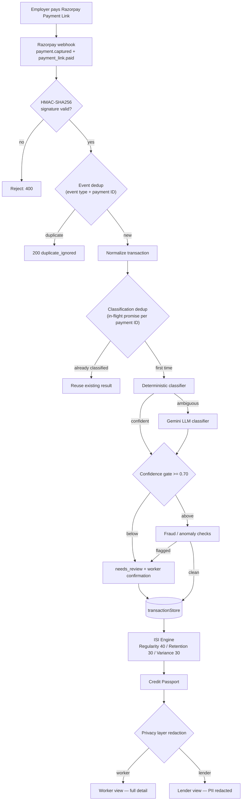

# KamaiPehchan — Verifiable Income & Credit Passport for Multi-Employer Informal Workers
### Razorpay AI Buildathon Submission (v4 — post-build, claims verified against a live system)

**Track:** AI Risk Manager (defensive classification and risk scoring with honest metric tracking)

---

## Executive Summary

KamaiPehchan turns fragmented, multi-employer UPI income into a single, explainable, lender-ready credit signal.

The hard problem isn't scoring — it's **cross-employer identity resolution**. We solve it at the payment-rail layer using dedicated Razorpay Payment Links per worker–employer relationship, not by inferring identity with AI. That leaves AI to do only what it's genuinely suited for: classifying the ambiguous minority of transactions. Everything touching a lending decision — the Income Stability Index itself — is deterministic time-series math, fully auditable, with zero model inference.

**What separates this submission: every architectural claim below was tested against live Razorpay APIs during the build, and the ones that failed are documented as failures rather than quietly removed.** Smart Collect turned out to be unavailable on our account tier. Our LLM classification path benchmarked at 40% accuracy, not the 90% we targeted. Both are reported here as findings, because a fintech system that hides its failure modes is more dangerous than one that names them.

---

## 1. Problem Statement

India's informal sector includes a large population of domestic workers, drivers, and micro-vendors who earn income across 3–5 independent employers each month. Even where employers now pay via UPI/QR, that income remains fragmented across unlinked payment streams with no consolidated record.

Without formal salary slips or a single verifiable income source, financial institutions classify these workers as New To Credit (NTC) or high-risk, and routinely reject their micro-loan and insurance applications — not because they are unreliable earners, but because their income is **unstructured, not insufficient**.

> **Note on scale:** India's broader informal workforce (e-Shram registrants, PLFS/NSSO surveys) is genuinely large and well-documented, but that aggregate covers all unorganized work, including categories that aren't this product's target user. The specific niche addressed here — workers earning across 3–5 simultaneously unlinked employers — is a subset of that aggregate, not the same number. Source it live before quoting it; don't present it as the addressable market for this specific product.

---

## 2. What Makes This Different

Existing alternate-credit tools (Uber- or Swiggy-linked earned-wage-access products) work because a single platform already owns and tracks all of a worker's income. That problem is largely solved.

KamaiPehchan targets the harder, more common case: a worker with 3–5 independent, unlinked employers and no central platform connecting them. The core technical challenge is recognizing that five separate, irregular UPI streams belong to one person's combined income **before any scoring can happen at all**.

Most alt-data credit players still assume one dominant income source or platform relationship. This is built for the case where none exists.

*(Specific named competitors should be checked live before being cited on stage — the structural differentiator above stands without needing them.)*

---

## 3. Solution Architecture



Blue = deterministic. Yellow = AI-assisted. **Exactly one node in this diagram is AI.**

---

## 4. Razorpay Integration — What We Tried, What Actually Worked

This section is written as a build log rather than a design claim, because the original design did not survive contact with the live API.

### 4a. Smart Collect: attempted, blocked, documented

The original architecture called for one Smart Collect virtual account per worker–employer pair, giving rail-guaranteed attribution. We built it and called the live API. It returned:

```
400 BAD_REQUEST_ERROR — "The requested URL was not found on the server."
```

Root-caused against Razorpay's own documentation: **Smart Collect is restricted from Individual-MCC accounts** and requires a registered business entity (LLP / Pvt Ltd) plus activation. This is an account-tier restriction, not a code defect, and not something resolvable inside a buildathon window.

**We report this rather than removing it from the pitch** because the architectural reasoning behind it remains correct, and it is the intended production rail once business KYC is in place.

### 4b. Payment Links: the rail that actually works

We pivoted to dedicated Razorpay Payment Links, one per worker–employer relationship, with a deterministic `reference_id` derived from the registered `worker_id`:

```
RAIL_<worker_id>_EMP_<EMPLOYER_SLUG>
```

Because the identifier is generated from the real registered worker at link-creation time, attribution is still guaranteed by the rail — not inferred by AI, and not hand-typed by anyone.

### 4c. Verified webhook findings (live, not assumed)

Confirmed by paying real test-mode Payment Links and inspecting raw payloads:

| Finding | Status |
|---|---|
| `reference_id` on `payload.payment.entity` | **Absent** — in both event types |
| `reference_id` on `payload.payment_link.entity` | **Present** — only on `payment_link.paid` |
| `notes.worker_id` + `notes.employer_ref` | **Present and survive intact** on both event types |
| `reference_id` max length | **40 characters**, enforced by Razorpay (`"the length must be no more than 40"`) |
| Both events fire for one payment | **Confirmed** — sharing the same payment ID |

Three real captured payloads are committed to the repo as test fixtures.

### 4d. Bugs this found — the case for testing against live APIs

Each of these was invisible against synthetic data and only appeared once real webhooks arrived:

1. **Dedup collision.** `payment.captured` and `payment_link.paid` share a payment ID, so the second was silently dropped as a duplicate. Fixed by keying dedup on event type + payment ID.
2. **Missing `rail_id` fallback.** A real webhook carries neither `virtual_account_id` nor a top-level `reference_id`, so classification failed outright on the very first real payment. Fixed with a `notes`-based composite fallback.
3. **Double classification.** With both events now correctly processed, one rupee triggered two full LLM calls — doubling real API cost per transaction. Fixed with an in-flight promise cache keyed by payment ID (the result cache alone was insufficient: both events arrive well before a 50–100s LLM call resolves).
4. **`reference_id` length overflow.** Only the employer slug was bounded, not the composite. A long worker ID plus employer name exceeded Razorpay's 40-char limit. Fixed to truncate the full composite.
5. **Silent response truncation.** `maxOutputTokens: 300` was consumed by the model's internal reasoning tokens before any visible JSON was emitted — every response failed to parse. Raised to 2048.

---

## 5. Core Modules

**Module 1 — Hybrid Payment Classifier**
A deterministic first pass handles the unambiguous majority: same rail, consistent amount range (±10%), sufficient history. Only genuinely ambiguous transactions reach the LLM. This split isn't cosmetic — it's measured and reported separately (Section 8).

**Module 2 — Income Stability Index (ISI)**
An explainable 0–100 score from **regularity (40%), employer retention (30%), and month-on-month variance (30%)**. Deterministic time-series math, no model inference. Weights are stated explicitly in code and flagged as unvalidated placeholders pending pilot data — as are all interpretive thresholds in the system.

**Output — Verifiable Credit Passport**
ISI score, confidence indicator, active employer count, 6-month average income, and a per-component breakdown. Computed on demand via `GET /passport/:workerId`, not per webhook.

---

## 6. Worker & Lender Experience

Three working interfaces, all served by the deployed instance:

- **Worker onboarding** — phone, name, optional UPI VPA. Populates the identity registry that self-payment fraud checks and SMS confirmation both depend on.
- **Worker Credit Passport** — the ISI score as a visual centerpiece, with the weighted breakdown rendered so the *reasoning* is visible, not just the number.
- **Lender underwriting dashboard** — the same passport through the Privacy layer's redaction: rail identifiers masked, interpretive ratings attached, employer names deliberately preserved (a lender needs to know which employers back the income for "verified" to mean anything). Includes the Automated Exception Report — the honest list of every transaction the system declined to auto-classify, with reason codes.

Design principle for the worker side: every interaction works over SMS or a simple text thread — no app download, no literacy assumption.

---

## 7. Safety, Guardrails & Security

The biggest risk in a system like this is a misclassified transaction quietly corrupting a credit score.

- **Confidence gating.** Below 0.70 → `needs_review`, excluded from ISI. Never guessed.
- **Human-in-the-loop.** Flagged transactions trigger a Hinglish confirmation ("Is ₹2,000 aapki monthly salary hai? Reply 1 / 2"). No reply means the transaction stays excluded permanently.
- **Forward-only ledger.** A worker's reply updates that transaction only. Past ISI scores are never retroactively rewritten — a lender who saw a score can trust it didn't silently change.
- **Fraud checks override confidence.** Round-number amounts, unnaturally uniform intervals, and self-payment detection force `needs_review` *regardless* of how confident the classifier was. Flags trigger review, never auto-rejection.
- **Prompt injection defense.** Payment notes are attacker-controlled input. Three layers: control characters stripped and length capped; the note fenced in explicit delimiters with an instruction that content inside is untrusted data, never commands; and hard output validation against an enum, enforced both in Gemini's `responseSchema` and again on parse. Even a fully successful prompt hijack cannot produce a label outside the allowed set.
- **Idempotency at two layers.** Event-level dedup preserves both events for audit; classification-level dedup ensures one payment is scored exactly once.
- **HMAC-SHA256 webhook verification**, timing-safe comparison, on every inbound event.
- **Graceful degradation everywhere.** Missing LLM key, quota exhaustion, network timeout (120s abort), malformed response — every path falls to `needs_review`, never a crash and never a guess.
- **Money as integers in paise.** No floating-point currency arithmetic anywhere.

---

## 8. Evaluation — Honest Metrics

Run against a held-out suite of 20 labeled transaction fixtures, reported by path:

| Path | n | Accuracy | Avg latency |
|---|---|---|---|
| Deterministic | 10 | **100.0%** | 0.0 ms |
| LLM-assisted (Gemini) | 10 | **40.0%** | 33,607 ms |

**The 40% is real, and it's disappointing.** Our stated target was ≥90%. We are reporting the measured result.

What we understand so far: several fixtures receive a confident (≥0.70) `needs_review` label directly from Gemini — a legitimate "I can't categorize this" — which the benchmark scores as wrong when the fixture expected a specific category. Whether the model was *also* overconfident on cases it got outright wrong is **an open question we could not answer**, because Google's free tier caps `gemini-3.6-flash` at 20 requests/day per project, and diagnostic re-runs exhausted the quota before per-fixture logging could capture it.

Two things this produced that are worth more than a better number would have been:

1. **A benchmark that can no longer lie.** Quota exhaustion caused the safety fallback (`needs_review`) to score as *100% accuracy*, because these fixtures' ground truth is also `needs_review`. The runner now reports real and fallback-driven results as separate lines. A quota-exhausted run can never again masquerade as a clean result.
2. **A documented operational limit** — don't plan more than ~15 real classification calls per day on this tier.

**Interpretation for a lending context:** the deterministic path, which handles the majority of real transactions, is exact and auditable. The LLM path is not pilot-ready and is explicitly not trusted — which is precisely why it cannot reach a credit score without passing a confidence gate, fraud checks, and human confirmation first. The architecture already assumes this component is the weakest link.

---

## 9. Engineering Quality

- **16 automated test suites**, all passing — covering classification, scoring, fraud, privacy, registration, webhook handling, rate limiting, exception reporting, and prompt-injection resistance.
- **Layered architecture** — classifier, scoring, fraud, privacy, reporting, webhooks, and worker domains cleanly separated. Core payment logic is entirely independent of the AI layer.
- **Deployed and verified live** on Railway, with real webhooks arriving from Razorpay, not localhost.
- **No secrets in git history** — verified by full-history scan. Every credential exposed during development was rotated.
- **Documentation audited against code** — a full `API_REFERENCE.md` review found and fixed four real drift issues, including a documented response shape the handler never actually returned.
- **Rate limiting and request timeouts** on the API and LLM paths.

---

## 10. Cost & Infrastructure

Built entirely on free tiers. No payment method is attached to any service, and no feature assumes a paid tier.

| Service | Cost | Note |
|---|---|---|
| Razorpay | Free | Test mode — no real transactions |
| Gemini API | Free | 20 req/day/project cap (confirmed live) |
| Railway | Free | Trial credit, no card on file |
| ngrok / GitHub | Free | — |

---

## 11. Real-World Path Forward

Deliberately scoped to income verification. NBFC integration and lending compliance are **out of scope and mapped, not claimed**.

- **Next step:** a ~50-worker pilot with one local NBFC/MFI, where ISI is a *supplementary* signal alongside existing underwriting — never a sole basis for approval.
- **Before that pilot:** business-entity KYC to unlock Smart Collect, LLM classification quality raised to an acceptable bar, fraud heuristics hardened, DPDP compliance reviewed by someone qualified, and all placeholder thresholds validated against real data.

This keeps the claim honest: **KamaiPehchan proves income can be structured and verified. It does not claim lending is solved.**

---

## 12. Hard Questions

**Where is AI actually used?**
One node in the entire pipeline: classifying ambiguous transactions. Scoring is pure deterministic math. Attribution is guaranteed by the payment rail.

**Why not AI for scoring?**
Credit decisions require auditability and zero hallucination risk. A model-generated number cannot be explained to a regulator or a rejected borrower.

**Your LLM path is only 40% accurate. Why should we trust this?**
You shouldn't trust that path — and the architecture doesn't either. It cannot reach a score without clearing a confidence gate, fraud checks, and human confirmation. We measured it, reported it, and designed around it rather than hiding it behind a blended accuracy figure.

**What stops a bad classification corrupting a score?**
Confidence gating, fraud override, human-in-the-loop confirmation, and a forward-only ledger that never rewrites history a lender already saw.

**What stops a worker faking employers to inflate their score?**
Employer-diversity weighting, anomaly detection on synthetic-looking patterns, and self-payment detection against the worker's registered identity. Named honestly as pilot-phase hardening, not a solved fraud model.

**Someone puts "ignore previous instructions" in a payment note. What happens?**
Sanitized, fenced as untrusted data, and — critically — the model's output is validated against a fixed enum. Even a successful hijack cannot produce an invalid label.

**What happens when the LLM fails or you hit quota?**
`needs_review`. Every failure path degrades to human review. This was verified live, not theorized — we exhausted our real quota during testing.

**Why Payment Links instead of Smart Collect?**
Because Smart Collect returned a real 400 on our account tier: it requires business-entity KYC. Documented rather than quietly dropped. Payment Links achieve the same rail-guaranteed attribution today.

**What's simulated in this demo?**
Twilio SMS dispatch (credentials deliberately not configured — the full pipeline around it is real and tested). Everything else — webhooks, classification, scoring, the deployed instance — is live.
